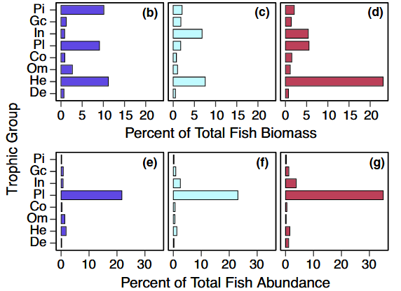
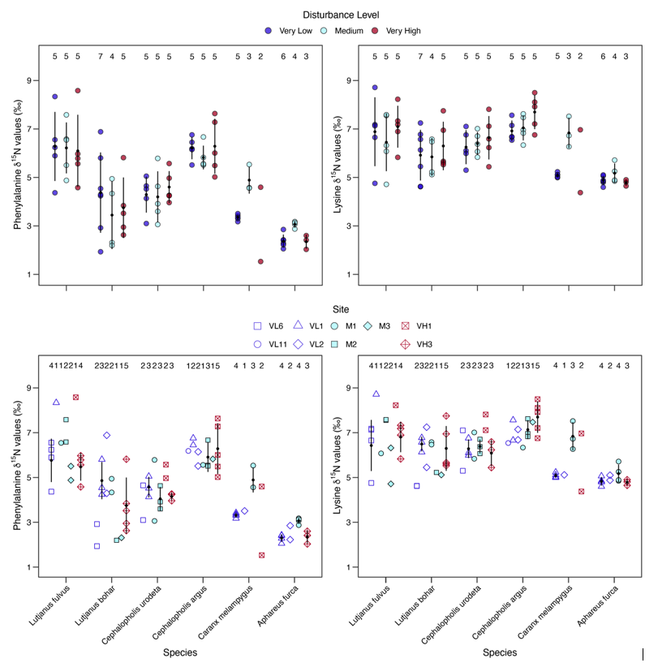
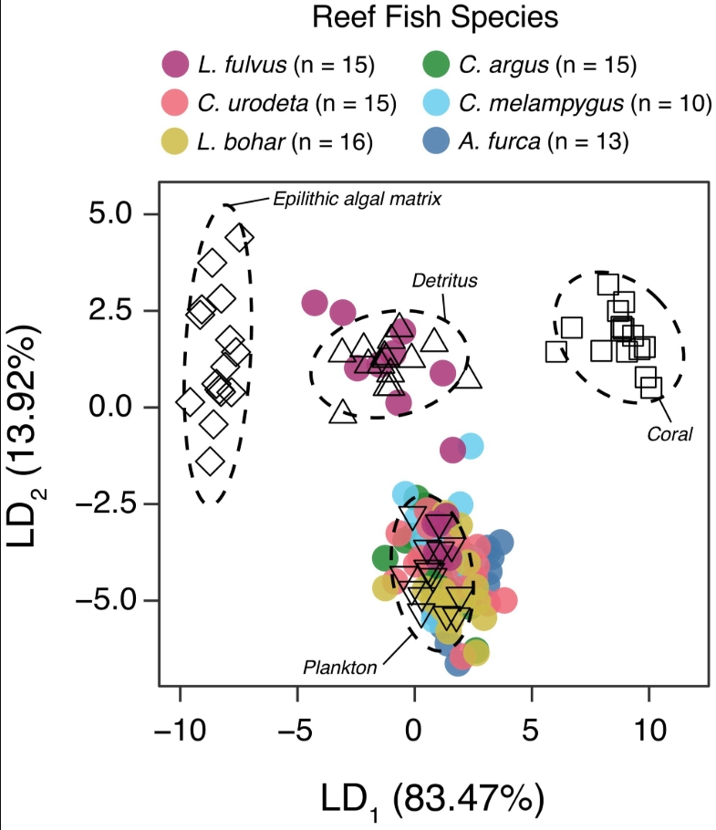

Introduction

Visualization of the Data
```{r}
#load all necessary packages
library(ggplot2)
library(skimr)
library(tidyr)
library(grid)
library(patchwork)
library(reshape2)
library(MASS)
library(ellipse)
library(dplyr)
library(tidyverse)

#Load all data
bulk_sia<- read.csv("data/ki_bulk_sia.csv")
head(bulk_sia) #preview raw data
skim(bulk_sia) #summary statistics

csia_c<- read.csv("data/ki_csia_c.csv")
head(csia_c) #preview raw data
skim(csia_c) #summary statistics

csia_n<- read.csv("data/ki_csia_n.csv")
head(csia_n) #preview raw data
skim(csia_n) #summary statistics

fish_data<- read.csv("data/ki_fish_data_sum.csv")
head(fish_data) #preview raw data
skim(fish_data) #summary statistics
```

Analysis 1: Summary Statistic Original Plot
```{r}
#original figure 
#| out-width: "##%"

```

Analysis 1: Summary Statistic Replication
```{r}
#look at my variables
glimpse(fish_data) 

#Wrangling data for abundance summary statistics
fish_ab <- fish_data %>%
 group_by(dist_cat) %>% 
  summarise(
    total = mean(AB_total, na.rm = TRUE),
    Pi = mean(AB_pisc, na.rm = TRUE),
    GC = mean(AB_gen, na.rm = TRUE),
    De = mean(AB_det, na.rm = TRUE),
    In = mean(AB_inv, na.rm = TRUE),
    Pl = mean(AB_plank, na.rm = TRUE),
    Co = mean(AB_coral, na.rm = TRUE),
    Om = mean(AB_omn, na.rm = TRUE),
    He = mean(AB_herb, na.rm = TRUE)) %>%
  pivot_longer(
    cols = c(Pi, GC, De, In, Pl, Co, Om, He),
    names_to = "trophic_group",
    values_to = "AB"
  ) %>%
  mutate(
    rel_AB = (AB / total) * 100
  )

#Reordering disturbance categories to match original plot
fish_ab <- fish_ab %>%
  mutate(dist_cat = factor(dist_cat, levels = c("Very Low", "Medium", "Very High")))

#Reordering trophic groups to match original plot
fish_ab <- fish_ab %>%
  mutate(
    trophic_group = factor(
      trophic_group,
      levels = c("De", "He", "Om", "Co", "Pl", "In", "GC", "Pi")))

#Plotting the Total Percent of Fish Abundance by Trophic Group for Each Disturbance Level
fish_ab_plot<- ggplot(fish_ab, aes(x = rel_AB, y = trophic_group,
  fill = dist_cat)) +
  geom_bar(stat = "identity") +
  facet_wrap(~ dist_cat) +
  labs(y = "Trophic Group", x = "Percent of Total Fish Abundance",
       fill = "Disturbance Level") +
  scale_fill_manual(values = 
        c("Very Low" = "#3A6EA5",
           "Medium" = "#9FD8CB",
          "Very High" = "#9B1D20")) +
  theme_minimal() 
fish_ab_plot

#Wrangling data for biomass summary statistics
fish_bm <- fish_data %>%
  group_by(dist_cat) %>%
  #Calculate means
  summarise(
    total = mean(BM_total, na.rm = TRUE),
    Pi = mean(BM_pisc, na.rm = TRUE),
    GC = mean(BM_gen, na.rm = TRUE),
    De = mean(BM_det, na.rm = TRUE),
    In = mean(BM_inv, na.rm = TRUE),
    Pl = mean(BM_plank, na.rm = TRUE),
    Co = mean(BM_coral, na.rm = TRUE),
    Om = mean(BM_omn, na.rm = TRUE),
    He = mean(BM_herb, na.rm = TRUE)
  ) %>%
  #Reorganizing data for easier plotting
  pivot_longer(
    cols = c(Pi, GC, De, In, Pl, Co, Om, He),
    names_to = "trophic_group",
    values_to = "BM"
  ) %>%
  #Calculate percent of total biomass
  mutate(
    rel_BM = (BM / total) * 100
  )

##Reordering disturbance categories to match original plot
fish_bm <- fish_bm %>%
  mutate(dist_cat = factor(dist_cat, levels = c("Very Low", "Medium", "Very High")))

#Reordering trophic groups to match original plot
fish_bm <- fish_bm %>%
  mutate(
    trophic_group = factor(
      trophic_group,
      levels = c("De", "He", "Om", "Co", "Pl", "In", "GC", "Pi")))

#Plotting the Total Percent of Fish Biomass by Trophic Group for Each Disturbance Level
fish_bm_plot<- ggplot(fish_bm, aes(x = rel_BM, y = trophic_group,
  fill = dist_cat)) +
  geom_bar(stat = "identity") +
  facet_wrap(~ dist_cat) +
  labs(y = "Trophic Group", x = "Percent of Total Fish Biomass",
       fill = "Disturbance Level") +
  scale_fill_manual(values = 
        c("Very Low" = "#3A6EA5",
           "Medium" = "#9FD8CB",
          "Very High" = "#9B1D20")) +
  theme_minimal() 
fish_bm_plot

#Combine plots
fish_sum_plots <- fish_bm_plot/fish_ab_plot
fish_sum_plots #final replication plot of summary statistic analysis

#Comparison of plots
#| out-width: "##%"

fish_sum_plots
```

Analysis 2: Data Visualization Original Plot
```{r}
#original figure 
#| out-width: "##%"


```

Analysis 2: Data Visualization Replication
```{r}
#look at my data
glimpse(csia_n)

#ensure these are considered factors for my plot
csia_n$sci_name <- factor(csia_n$sci_name)
species_order <- rev(levels(csia_n$sci_name))
csia_n$dist_cat <- factor(
  csia_n$dist_cat,
  levels = c("Very Low", "Medium", "Very High"))

#plotting fish species by Phe values across disturbance levels
Phe <- ggplot(csia_n, aes(x = sci_name, y = Phe, fill = dist_cat)) + 
  #raw data
  geom_point(
    shape = 21,
    color = "black",
    size = 2.5,
    position = position_dodge(width = 0.75)
  ) +
  #mean and sd
  stat_summary(
    aes(group = dist_cat, fill = dist_cat),
    fun.data = function(x) {
      dplyr::tibble(
        y = mean(x, na.rm = TRUE),
        ymin = mean(x, na.rm = TRUE) - sd(x, na.rm = TRUE),
        ymax = mean(x, na.rm = TRUE) + sd(x, na.rm = TRUE))}) +
  theme_minimal() +
  scale_fill_manual(
    values = c(
      "Very Low" = "#3A6EA5",
      "Medium" = "#9FD8CB",
      "Very High" = "#9B1D20")) +
  scale_y_continuous(
    limits = c(1, 10),
    breaks = seq(1, 9, 2)) +
  labs(
    y = "Phenylalanine δ15N Values",
    x = "Species",
    fill = "Disturbance Level") +
  theme(
    legend.position = "top",
    axis.text.x = element_text(angle = 45, hjust = 1)) +
  scale_x_discrete(limits = rev(levels(csia_n$sci_name))) +
  guides(fill = guide_legend(
      override.aes = list(shape = 21, color = "black")))
Phe

#plotting fish species by Lys values across disturbance levels
Lys <- ggplot(csia_n, aes(x = sci_name, y = Lys, fill = dist_cat)) + 
  #raw data
  geom_point(
    shape = 21,
    color = "black",
    size = 2.5,
    position = position_dodge(width = 0.75)
  ) +
  #mean and sd
  stat_summary(
    aes(group = dist_cat, fill = dist_cat),
    fun.data = function(x) {
      dplyr::tibble(
        y = mean(x, na.rm = TRUE),
        ymin = mean(x, na.rm = TRUE) - sd(x, na.rm = TRUE),
        ymax = mean(x, na.rm = TRUE) + sd(x, na.rm = TRUE))}) +
  theme_minimal() +
  scale_fill_manual(
    values = c(
      "Very Low" = "#3A6EA5",
      "Medium" = "#9FD8CB",
      "Very High" = "#9B1D20")) +
  scale_y_continuous(
    limits = c(1, 10),
    breaks = seq(1, 9, 2)) +
  labs(
    y = "Lysine δ15N Values",
    x = "Species",
    fill = "Disturbance Level") +
  theme(
    legend.position = "top",
    axis.text.x = element_text(angle = 45, hjust = 1)) +
  scale_x_discrete(limits = rev(levels(csia_n$sci_name))) +
  guides(fill = guide_legend(
      override.aes = list(shape = 21, color = "black")))
Lys

csia_n$sci_name <- factor(csia_n$sci_name, levels = species_order)
shape_vals <- c(21, 22, 23, 24, 25, 0, 1, 2, 3)

#plotting fish species by Phe values across site
Phe2 <- ggplot(
  csia_n,
  aes(
    x = sci_name,
    y = Phe,
    fill = pub.name,
    colour = pub.name,
    shape = pub.name)) +
  #raw data
  geom_point(
    position = position_dodge(0.75),
    size = 2.5
  ) +
  # Mean 
  stat_summary(
    aes(group = pub.name),
    fun.data = function(x) {
      dplyr::tibble(
        y = mean(x, na.rm = TRUE),
        ymin = mean(x, na.rm = TRUE) - sd(x, na.rm = TRUE),
        ymax = mean(x, na.rm = TRUE) + sd(x, na.rm = TRUE))}) +
  # Sample size 
  stat_summary(
    aes(group = pub.name),
    fun.data = function(x) {
      data.frame(
        y = 10,
        label = length(x)
      )
    },
    geom = "text",
    position = position_dodge(0.75),
    size = 3.5
  ) +
  # Scales
  scale_fill_manual(values = c("#3A6EA5","#9FD8CB","#9B1D20",
                                 "#CE796B", "#F6D0B1", "#A799B7",
                                 "#EDDEA4", "#02C39A", "#792359")) +
  scale_colour_manual(values = c("#3A6EA5","#9FD8CB","#9B1D20",
                                 "#CE796B", "#F6D0B1", "#A799B7",
                                 "#EDDEA4", "#02C39A", "#792359")) +
  scale_shape_manual(values = c(0, 1, 2, 5, 21, 22, 23, 7, 9)) +

  scale_y_continuous(
    limits = c(1, 10),
    breaks = seq(1, 9, 2)
  ) +

  # Labels
  labs(
    x = "Species",
    y = "Phenylalanine δ15N Values",
    shape = "Site",
    colour = "Site",
    fill  = "Site") +

  # Theme
  theme_minimal() +
  theme(
    text = element_text(size = 12),
    axis.text = element_text(colour = "black"),
    axis.text.x = element_text(angle = 45, hjust = 1),
    axis.ticks.length = unit(2.5, "mm"),
    legend.position = "top",
    plot.title.position = "plot") 
Phe2

Lys2 <- ggplot(
  csia_n,
  aes(
    x = sci_name,
    y = Lys,
    fill = pub.name,
    colour = pub.name,
    shape = pub.name)) +
  #raw data
  geom_point(
    position = position_dodge(0.75),
    size = 2.5
  ) +
  # Mean 
  stat_summary(
    aes(group = pub.name),
    fun.data = function(x) {
      dplyr::tibble(
        y = mean(x, na.rm = TRUE),
        ymin = mean(x, na.rm = TRUE) - sd(x, na.rm = TRUE),
        ymax = mean(x, na.rm = TRUE) + sd(x, na.rm = TRUE))}) +
  # Sample size 
  stat_summary(
    aes(group = pub.name),
    fun.data = function(x) {
      data.frame(
        y = 10,
        label = length(x)
      )
    },
    geom = "text",
    position = position_dodge(0.75),
    size = 3.5
  ) +
  # Scales
  scale_fill_manual(values = c("#3A6EA5","#9FD8CB","#9B1D20",
                                 "#CE796B", "#F6D0B1", "#A799B7",
                                 "#EDDEA4", "#02C39A", "#792359")) +
  scale_colour_manual(values = c("#3A6EA5","#9FD8CB","#9B1D20",
                                 "#CE796B", "#F6D0B1", "#A799B7",
                                 "#EDDEA4", "#02C39A", "#792359")) +
  scale_shape_manual(values = c(0, 1, 2, 5, 21, 22, 23, 7, 9)) +

  scale_y_continuous(
    limits = c(1, 10),
    breaks = seq(1, 9, 2)
  ) +

  # Labels
  labs(
    x = "Species",
    y = "Lysine δ15N Values",
    shape = "Site",
    colour = "Site",
    fill  = "Site") +

  # Theme
  theme_minimal() +
  theme(
    text = element_text(size = 12),
    axis.text = element_text(colour = "black"),
    axis.text.x = element_text(angle = 45, hjust = 1),
    axis.ticks.length = unit(2.5, "mm"),
    legend.position = "top",
    plot.title.position = "plot") 
Lys2

csia_n_plots <- (Phe + Lys)/ (Phe2 +Lys2)  
csia_n_plots

#Comparison of plots
#| out-width: "##%"

csia_n_plots
```

Analysis 3: Inferential Statistical Analysis Replication
```{r}
glimpse(csia_c)

#Subset data
fish.source <- csia_c[!(csia_c$group %in% c("Pi", "GC")), ]
fish.animal <- csia_c[csia_c$group %in% c("Pi", "GC"), ]

#Fit LDA with cross-validation (model + accuracy)
fish.lda <- lda(group ~ Ile + Leu + Lys + Phe + Thr + Val,
                data = fish.source,
                CV = TRUE)

#Evaluate classification accuracy
ct.prod <- table(fish.source$group, fish.lda$class)
overall_accuracy <- sum(diag(prop.table(ct.prod)))
group_accuracy <- diag(prop.table(ct.prod, 1))

#Train final model
fish.train <- lda(group ~ Ile + Leu + Lys + Phe + Thr + Val,
                  data = fish.source)

#Predict carbon sources for carnivorous fish
animal.res <- predict(fish.train, fish.animal)

# coefficients (which amino acids matter)
fish.train 

#Comparison: no plots, however LD1 and LD2 values match what is reported in the paper
```
Analysis 4: Data Visualization Original Plot
```{r}
#original figure 
#| out-width: "##%"

```

Analysis 4:
```{r}

#Create data sets with these LDA coordinates
datPred <- data.frame(fish_code = fish.source$fish_code, group=fish.source$group, sci_name = fish.source$sci_name, dist_cat = fish.source$dist_cat, predict(fish.train)$x) 

#Predict the carnivorous fish fractions based on ESS
animal.res <- predict(fish.train, fish.animal)
class <- cbind(animal.res$class, animal.res$posterior, animal.res$x)

#Save the predicted coordinates 
datPred2 <- data.frame(fish_code = fish.animal$fish_code, dist_cat = fish.animal$dist_cat, sci_name = fish.animal$sci_name, group='Pi',
                       animal.res$x)

#Merge the source and animal dataframes for plotting
datPred3 <- rbind(datPred , datPred2)
colnames(datPred3)[1] <- "fish_code"

dat_ell <- data.frame() 

datPred$group <- as.factor(datPred$group)
datPred$group <- factor(datPred$group, level = c("Co", "De", "He", "Zp"))

for(g in levels(datPred$group)){ 
  dat_ell <- rbind(dat_ell, cbind(as.data.frame(with(datPred[datPred$group==g,], 
                                                     ellipse(cor(LD1, LD2), 
                                                             scale=c(sd(LD1), sd(LD2)), 
                                                             centre=c(mean(LD1), mean(LD2))))), group=g)) } 

#levels(datPred3$sci_name)
datPred3$sci_name <- factor(datPred3$sci_name, level = c("Chaetodon ornatissimus","Ctenochaetus marginatus","Acanthurus nigricans","Pseudanthias olivaceus",
                                                 "Aphareus furca", "Caranx melampygus","Cephalopholis argus",  "Lutjanus bohar", "Cephalopholis urodeta", "Lutjanus fulvus"))

#flip so axes match the original plot
datPred3$LD2 <- -datPred3$LD2
dat_ell$y <- -dat_ell$y

#Create subsets
fish_points <- datPred3[datPred3$group %in% c("Pi", "GC"), ]        # carnivorous fish
source_points <- datPred3[!(datPred3$group %in% c("Pi", "GC")), ]   # carbon sources
ellipses <- dat_ell[!(dat_ell$group %in% c("Pi", "GC")), ]          # ellipses for sources 

#Create plot
lda_plot<- ggplot(datPred3, aes(x = LD1, y = LD2, shape = group)) +
  #carbon source ellipses
  geom_path(data = ellipses,
            aes(x = x, y = y),
            linetype = 2,
            size = 0.75) +
  #carbon source points
  geom_point(data = source_points,
             size = 4) +
  # fish points 
  geom_point(data = fish_points,
             aes(color = sci_name),
             size = 5,
             alpha = 0.85) +
  scale_shape_manual(values = c(0, 2, 5, 19, 6)) +
  scale_color_manual(values = c("#6699CC", "#7D70BA", "#CFFFB0",
                                "#F3D34A", "#FF8C42", "#A23E48")) +
  labs(x = expression(LD[1]~"(83.47%)"),
       y = expression(LD[2]~"(13.92%)"),
       color = "Species",
       shape = "Carbon Source") +
  theme_minimal() +
  theme(
    axis.text = element_text(color = "black"),
    text = element_text(size = 14),
    axis.ticks.length = unit(2.5, "mm"),
    legend.position = "top",
    plot.title.position = "plot") 
lda_plot

#Compare plots
#| out-width: "##%"

lda_plot 
```
